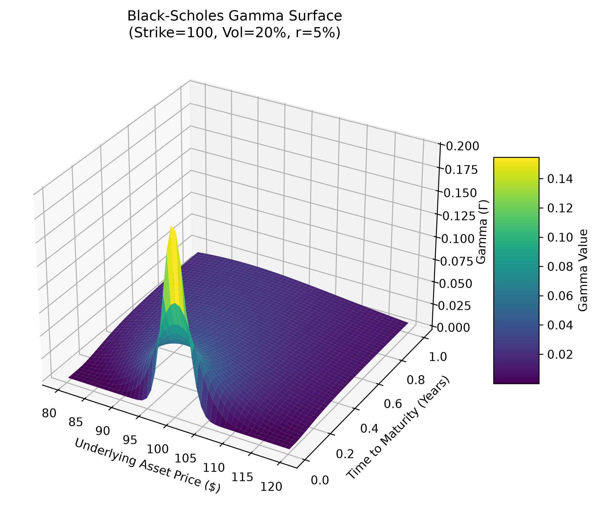

# Black-Scholes Pricing Engine & Risk Surface Generator

A highly optimized, vectorized options pricing engine built in Python. This project calculates the theoretical value of European Call and Put options and generates the core risk sensitivities (The Greeks: Delta, Gamma, Vega, Theta). 



## Overview
This engine is designed for performance, utilizing NumPy array broadcasting to calculate thousands of option prices and risk metrics simultaneously without relying on slow `for` loops. The visualization module maps these outputs into a 3D surface, demonstrating how convexity (Gamma) shifts with respect to time and the underlying asset price.

## Tech Stack
* **Python 3.x**
* **NumPy:** Vectorized mathematical operations and standard normal distribution modeling.
* **SciPy:** Advanced statistical functions (`scipy.stats.norm`).
* **Matplotlib:** 3D risk surface rendering.

## The Mathematical Model
The engine is built on the foundational Black-Scholes-Merton equations:
* Call Price: `C = S * N(d1) - K * e^(-rT) * N(d2)`
* Put Price: `P = K * e^(-rT) * N(-d2) - S * N(-d1)`

## Installation & Usage

1. Clone the repository:
   ```bash
   git clone [https://github.com/Biswa1930/Black-Scholes-Pricer.git](https://github.com/Biswa1930/Black-Scholes-Pricer.git)
   cd Black-Scholes-Pricer